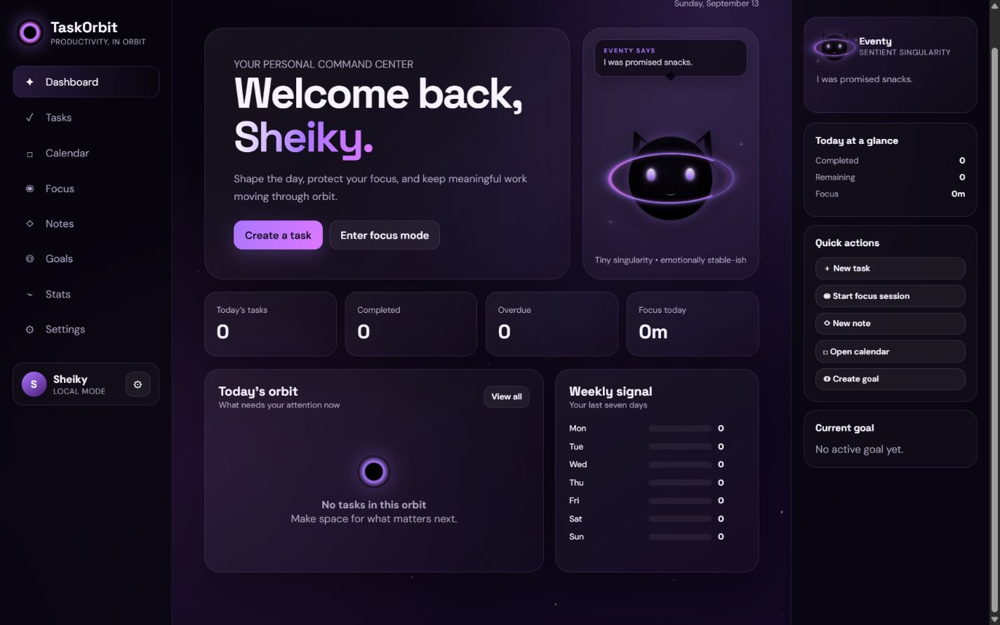
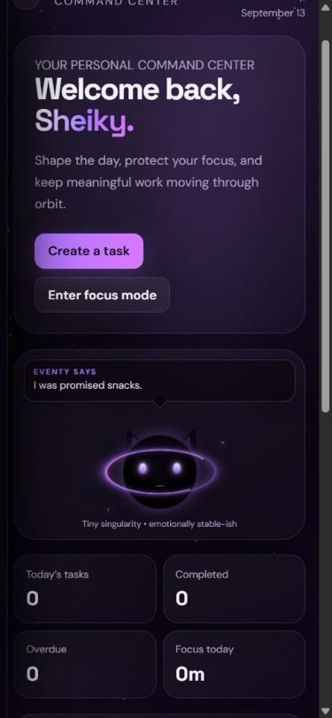

# TaskOrbit

TaskOrbit is a local-first cosmic productivity dashboard for tasks, focus sessions, notes, goals, calendar planning, and personal progress. Eventy, a tiny black-hole companion, adds subtle personalized guidance without getting in the way.



<details>
<summary>Mobile dashboard</summary>



</details>

## Features

- First-run onboarding with a persistent display name and focus preferences
- Reusable pure HTML/CSS Eventy mascot with expressive eyes, integrated cat-ear silhouette, animated accretion ring, responsive sizing, and task/focus reaction states
- Personalized Eventy dialogue that rotates on a randomized 20–45 second cadence without immediate repeats
- Local-time clock, date, and morning/afternoon/evening/night greetings
- Full task CRUD with descriptions, due date/time, priority, category, tags, reminders, search, filters, and sorting
- Timestamp-based focus timer with Pomodoro, Deep Focus, Quick Sprint, custom durations, rounds, pause/resume/reset/skip/+5 minutes, refresh recovery, optional notifications, and persistent statistics
- Autosaving, searchable, pinnable notes
- Goals with status, target date, progress, and associated tasks
- Lightweight monthly calendar with date selection and task creation
- Dashboard and statistics for daily/weekly output, completion rate, categories, priorities, focus minutes, and streaks
- Four themes, adjustable animation, reduced-motion support, sound/notification preferences, and completed-task behavior
- Validated JSON export/import and destructive-action confirmations
- Guest/local profile mode plus optional real Google sign-in through Firebase Authentication

## Architecture

TaskOrbit is a dependency-free ES-module application. Feature rules are separated from rendering so the persistence layer or UI can be replaced later without rewriting core behavior.

```text
TaskOrbit/
├── index.html
├── config.example.js
├── netlify.toml
├── package.json
├── css/
│   └── main.css
├── js/
│   ├── app.js          # SPA rendering and interaction coordination
│   ├── auth.js         # local profile and optional Firebase Google OAuth
│   ├── eventy.js       # companion messages and cooldown
│   ├── stars.js        # lightweight canvas star field
│   ├── storage.js      # versioned storage, migration, export/import validation
│   ├── tasks.js        # task model, search, filtering, sorting
│   ├── time.js         # local date, clock, greeting, overdue rules
│   └── timer.js        # timestamp countdown and session transitions
├── tests/
│   ├── personalization.test.js
│   ├── storage.test.js
│   ├── tasks.test.js
│   ├── time.test.js
│   └── timer.test.js
└── assets/
```

## Tech stack

- Semantic HTML5
- Modern CSS (Grid, custom properties, glass surfaces, responsive layouts)
- Vanilla JavaScript ES modules
- Canvas 2D for the ambient star field
- Browser `localStorage` for local-first persistence
- Node's built-in test runner
- Optional Firebase Authentication loaded only when configured

## Local development

ES modules must be served over HTTP rather than opened with `file://`.

```bash
cd TaskOrbit
python -m http.server 4173
```

Open `http://localhost:4173`. No package installation or build step is required.

## Testing

Node.js 20 or newer is recommended.

```bash
npm test
```

The suite covers task creation, editing, deletion behavior, completion, filtering, searching, sorting, timer calculations and persistence inputs, local greeting boundaries, username personalization, storage migration, and import validation.

## Authentication

Local mode is the default and fully functional. It is a device-local profile, not a claim of server authentication; TaskOrbit never asks for or stores a password.

Google sign-in uses Firebase Authentication only when configured. The application does not provide fake Google login behavior. Task data remains local in this release even when the identity comes from Google.

### Firebase / Google setup

1. Create a Firebase project and register a Web app.
2. In **Authentication → Sign-in method**, enable **Google**.
3. In **Authentication → Settings → Authorized domains**, add `localhost` and your Netlify domain.
4. Copy `config.example.js` to `config.local.js` and fill in the public Firebase Web configuration values.
5. Add `<script src="config.local.js"></script>` immediately before the module script in `index.html`.
6. Keep `config.local.js` uncommitted. It is already included in `.gitignore`.

Firebase Web API keys identify the project and are visible in browsers by design; they are not admin credentials. Never place service-account JSON, Admin SDK keys, OAuth client secrets, or private server keys in this project. If Firestore is added later, restrictive Security Rules are mandatory.

For a team deployment, generate the runtime config during CI from Netlify environment variables such as `FIREBASE_API_KEY`, `FIREBASE_AUTH_DOMAIN`, `FIREBASE_PROJECT_ID`, and `FIREBASE_APP_ID` instead of committing `config.local.js`. The current local-only deployment needs no environment variables.

## Deployment on Netlify

1. Add the project directory as a new Netlify site or connect its Git repository.
2. Leave the build command empty.
3. Set the publish directory to `.`.
4. Deploy. `netlify.toml` supplies the publish directory and security headers.
5. If enabling Google sign-in, add the Netlify hostname to Firebase Authorized Domains and provide the runtime config described above.

Because the app is static, any simple static host also works.

## Security and privacy

- User-authored content is escaped before it enters generated markup.
- Imported backups are parsed and schema-checked before replacement.
- Deletions and destructive imports require confirmation.
- No passwords or client secrets are stored.
- The local profile and productivity data stay in the current browser's local storage.
- Browser notifications are opt-in and only requested when enabled.

Do not use local mode on a shared OS/browser profile for sensitive information. Clearing site data clears the local TaskOrbit database.

## Accessibility

TaskOrbit uses semantic landmarks, labels, keyboard-operable controls, visible focus rings, live toast announcements, descriptive control labels, high-contrast themes, responsive reflow, and `prefers-reduced-motion`. The explicit reduced-motion setting also disables the animated canvas.

## Known limitations

- Productivity data is local to one browser and does not yet sync to Firebase or another backend.
- Google sign-in requires external Firebase configuration and network access; it cannot be fully exercised without the project owner's Firebase credentials and authorized domain.
- Reminders depend on the browser being open and notification permission being granted; there is no service worker or background push service.
- The completion chime is synthesized with the Web Audio API; browsers may defer it until the user has interacted with the page.
- Notes are plain text rather than rendered Markdown.

## Roadmap

- Optional encrypted cloud sync with per-user Firebase Security Rules
- Service-worker installation and background reminder delivery
- PWA/offline asset caching
- Drag-and-drop task ordering and richer recurring tasks
- Accessible data visualizations with longer-range comparisons
- Additional Eventy expressions for streak milestones and overdue-task recovery

## Screenshots

Validated desktop and mobile dashboard captures are stored in `docs/`. Refresh both after material interface changes so the project presentation stays current.
